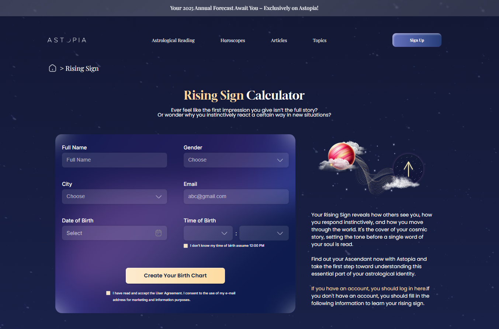
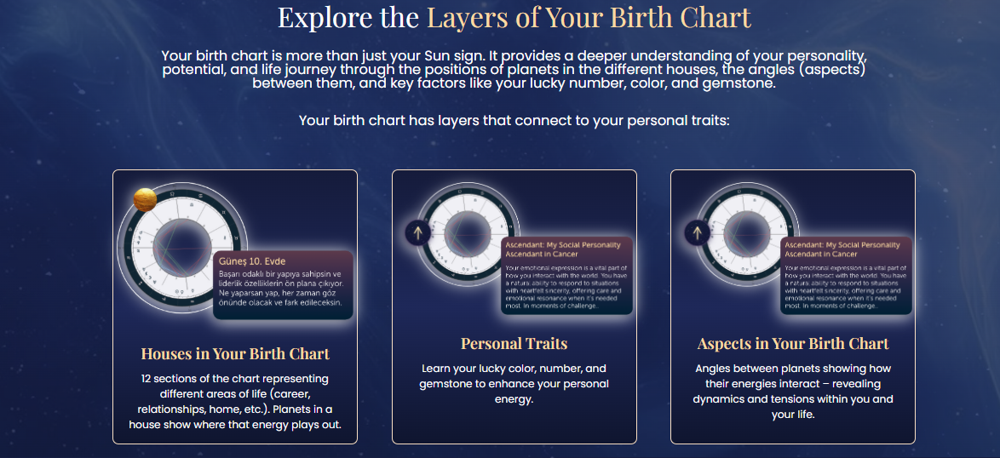
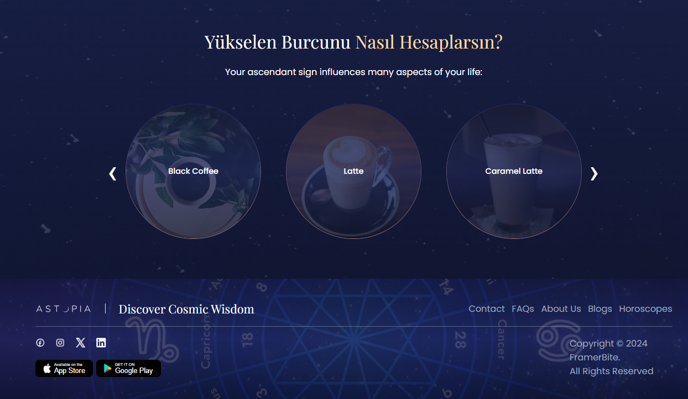

# 🌌 Astopia Case

Astopia is a modern Vue.js-based web application that allows users to explore their birth charts visually and interactively. The app presents the layered structure of astrological signs through a stunning design, prioritizing user experience. With a cohesive dark theme, circular cards, scrollable components, and API integrations, Astopia offers both an aesthetic and functional platform for astrology enthusiasts.

## 🚀 Features

- 🎠 **Horizontal Scrollable Slider:**

  - Responsive circular card layout
  - Scrollable with left/right buttons
  - Optimized for mobile, tablet, and desktop

- ☕ **Coffee API Integration:**
  - Fetches coffee data from `https://api.sampleapis.com/coffee/hot`
  - Displays coffee names and images inside circular cards

## 🛠 Technologies Used

- Vue 3 + `<script setup>`
- Composition API (`ref`, `computed`, `watch`, `onMounted`)
- Responsive design
- REST API fetch operations

## 🧩 Installation

1. Clone the repository:

   ```bash
   git clone https://github.com/semaozkan/astopia-case.git
   cd astopia-case
   ```

2. Install dependencies:

   ```bash
   npm install
   ```

3. Start the development server:

   ```bash
   npm run dev
   ```

4. Open the app in your browser:
   ```
   http://localhost:5173
   ```

---

## 👩‍💻 Developer

This project was developed as a **case study**, aiming to showcase Vue.js capabilities along with UI/UX design skills.

> Developer: Semanur Özkan  
> Email: [semanurozkan4444@gmail.com](mailto:semanurozkan4444@gmail.com)

---

## 🖼️ Screenshots






